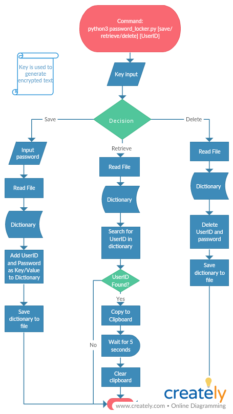

So there I was, reading an article about how we should keep different passwords for different accounts online. Life is already a chaos and having to remember so many passwords is just an overhead. Keeping all UserIDs and passwords in a text file is also not an option keeping in mind how safe we are in our online world ;-) . That's when an idea to build this application stuck me.

## Introdunction to the PasswordLocker

PasswordLocker in a command line application, written in python, where you can save, retrieve, and delete your passwords. It stores your password in encrypted form. Encryption is done through a key only you know about. No-one can figure out what the key is or what UserIDs and related passwords are even if they have the source code of app or the encrypted text (someone on a very high level might figure it out but in that sense.. what is safe now-a-days?). Passwords are saved in UserID/password combinations and UserID is used to refer to this combination.

## What is the idea behind it?

PasswordLocker removes the overhead of remembering your passwords. You just have to remember the key you used the first time you used the application. Now you can keep different passwords for all of your online accounts and PasswordLocker will remember it for you. PasswordLocker stores your password in a seperate file in encrypted form which can only be decypted with the key you enter in the application.

## How to use it?

PasswordLocker is a command line tool so commands are used to control it. The structure of the command is:

`python3 password_locker.py [save/retireve/delete] [UserID]`

The command takes 2 arguments. First one is the task to be performed and the other is UserID. Here, UserID is the used to refer to the UserID/password combination.

## How the application works

When the application starts, the application will ask for the key used to encrypt the saved information. If key in wrong, a message will be shown stating the same and program will exit. If not, program will continue..

### Save

When we give a command to save password, what happens is
* The program take input the password that will go with UserID we gave.
* It will then read the file where all UserID/pasword pairs are stored and decypts the encrypted text to convert it to a python dictionary.
* It will then add the UserID/password pair to the python dictionary
* It stores the python dictionary back to the file.

### Retrieve

When we give a command to retireve password, what happens is
* It will then read the file where all UserID/pasword pairs are stored and decypts the encrypted text to convert it to a python dictionary.
* It will then search for the UserID in all UserID/password pairs.
* If the UserID is found, it will copy the password to the clipboard for 5 seconds and then it will clear the clipboard so that no-one else or no other application can read clipboard.
* If not found, it will exit with a message stating the status.

### Delete

When we give a command to delete password, what happens is
* It will then read the file where all UserID/pasword pairs are stored and decypts the encrypted text to convert it to a python dictionary.
* It will then search for the UserID in all UserID/password pairs.
* If the UserID is found, it will delete the UserID/password pair.
* If not found, it will do nothing and simply exit.
